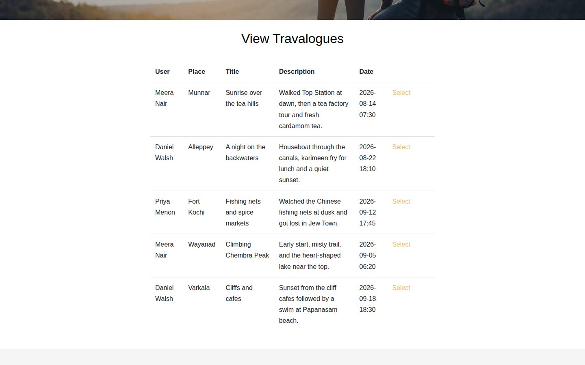
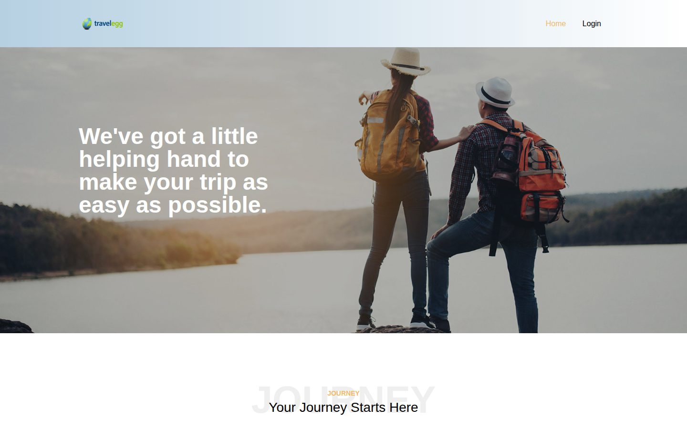
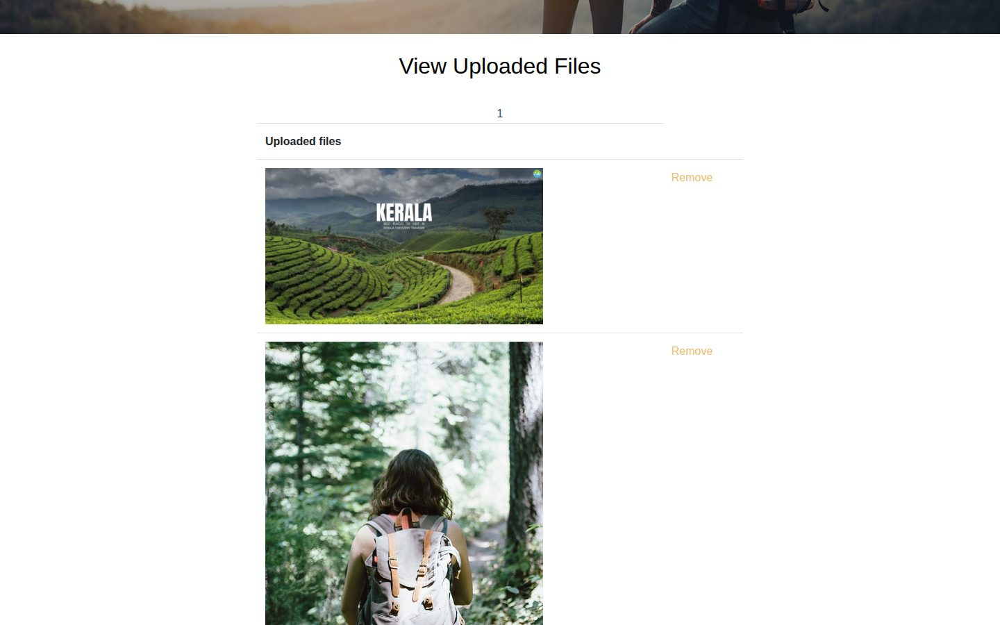
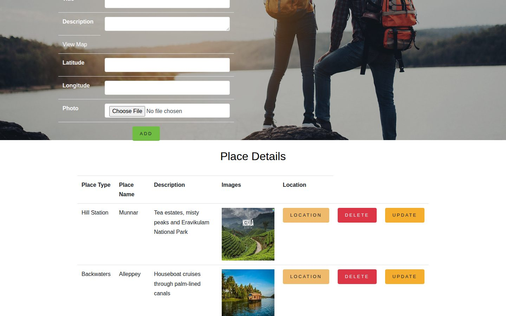
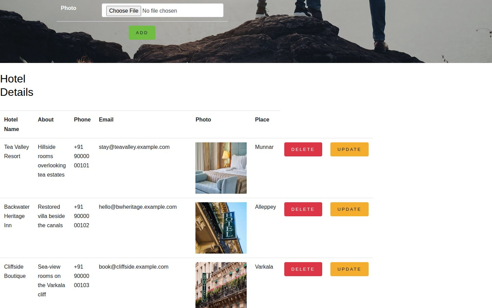
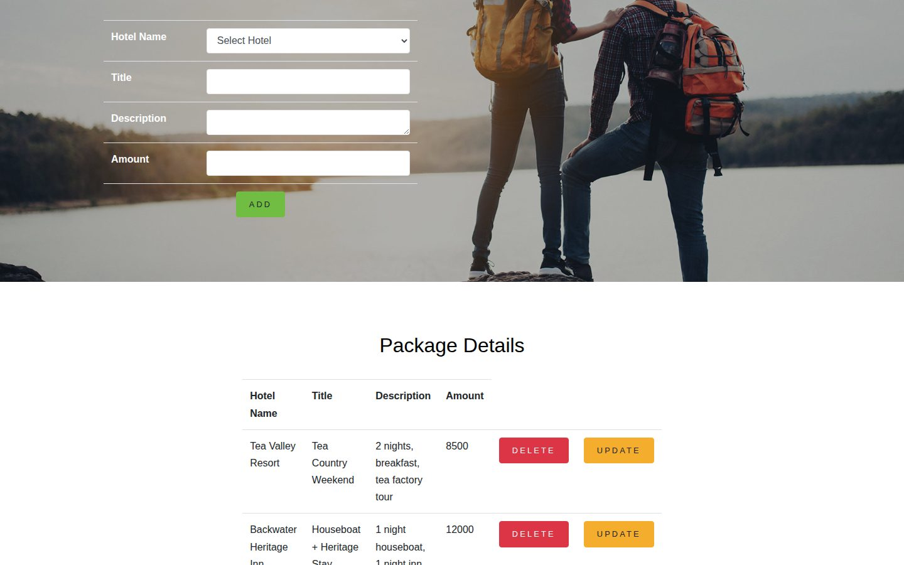
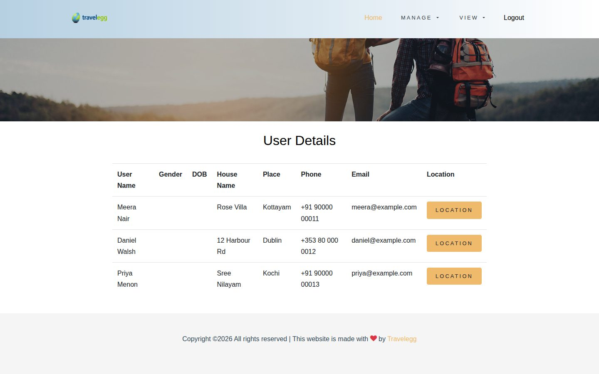
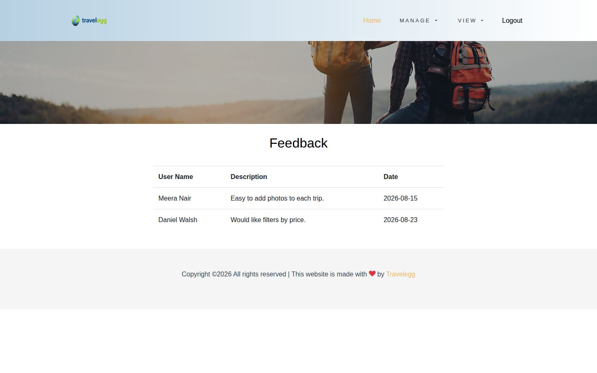
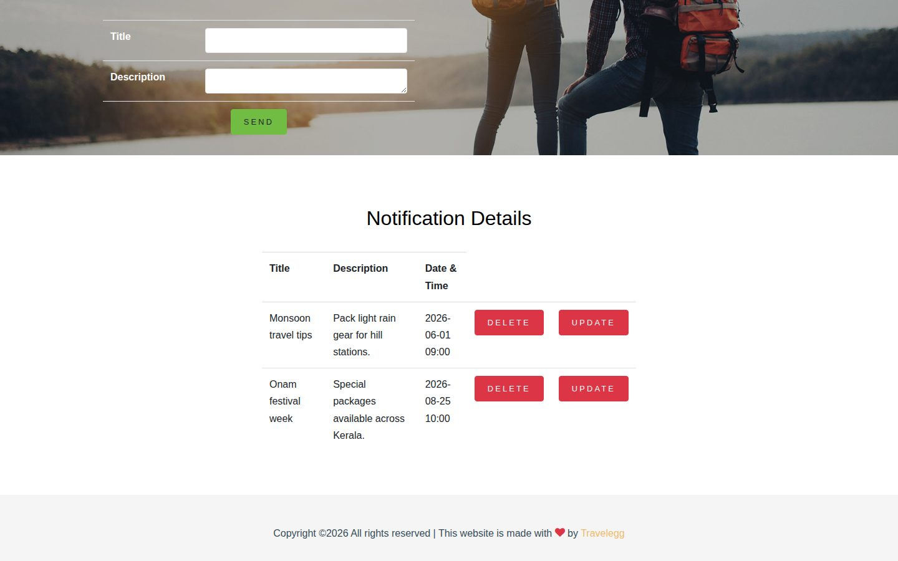
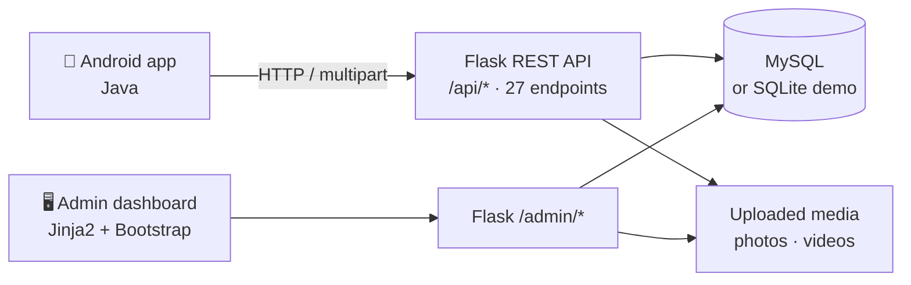

<div align="center">

# ✈️ Smart Travelogue

**A travel-journal platform: write travelogues, share trip photos and videos, and discover places, hotels and packages.**

Native Android app for travellers · Flask + MySQL REST API · admin dashboard for content and notifications

[](https://vercel.com/new/clone?repository-url=https%3A%2F%2Fgithub.com%2Falokekissac%2FSmart-Travelogue&project-name=smart-travelogue)


</div>



---

## 📑 Contents

[Overview](#-overview) · [Screenshots](#-screenshots) · [Features](#-features) · [Architecture](#%EF%B8%8F-architecture) · [Demo accounts](#-demo-accounts) · [Run locally](#-run-locally) · [Deploy to Vercel](#%EF%B8%8F-deploy-to-vercel) · [API](#-rest-api) · [Project structure](#%EF%B8%8F-project-structure) · [Limitations](#-known-limitations) · [Author](#-author)

---

## 🔭 Overview

Travel memories end up scattered across camera rolls and chat groups. **Smart Travelogue** gives each trip a home: a written travelogue with its photos, videos and YouTube links, which other travellers can browse for inspiration. Alongside that, travellers can explore places, hotels and hotel packages curated by an admin, and receive notifications and travel tips.

Built as my **BCA main project** at Girideepam Institute of Advanced Learning.

---

## 📸 Screenshots

| | |
|---|---|
|  |  |
| **Landing page** | **Photos uploaded to a travelogue** |
|  |  |
| **Admin: places with map locations** | **Admin: hotels** |
|  |  |
| **Admin: hotel packages** | **Admin: registered travellers** |
|  |  |
| **Admin: traveller feedback** | **Admin: notifications sent to the app** |

<sub>Screenshots use the fictional Kerala demo data in <code>database/demo_data.sql</code>.</sub>

---

## ✨ Features

### 🎒 Travellers (Android app)
- 📝 **Travelogues:** write, view and delete trip stories (place, title, story, date)
- 📸 **Media:** upload photos, videos and YouTube links to each travelogue, and manage the gallery
- 🌍 **Community:** browse other travellers' travelogues, photos and videos
- 🏨 **Discover:** places, nearby places, hotels and hotel packages; save places you're interested in
- 🔔 **Stay in touch:** notifications, feedback and complaints

### 🛡️ Admin (web dashboard)
- Manage **place types, places** (with latitude and longitude), **hotels** and **packages**
- Moderate **travelogues** and their uploaded media
- View **registered users** and **feedback**
- Send **notifications** to every app user

### 🌐 Public
- Anyone can browse shared travelogues, photos and videos without signing in

---

## 🏗️ Architecture



- **One Flask app** with three blueprints: `public` (landing page and login), `admin` and `api` (the Android app).
- **Two database modes:** MySQL for local and production use, or a bundled **SQLite demo database**, which is used automatically on Vercel.
- **Media uploads** go to `public/static/uploads` locally, or to `/tmp` on Vercel.

---

## 🔑 Demo accounts

| Role | Username | Password |
|---|---|---|
| Admin (web) | `admin` | `admin` |
| Traveller (Android) | `meera` · `daniel` · `priya` | `demo123` |

The demo data has 6 Kerala destinations, 5 hotels with packages, 3 travellers and 5 illustrated travelogues. All people and hotels in it are fictional.

---

## 🚀 Run locally

**Quick start (no MySQL needed):**

```bash
git clone https://github.com/alokekissac/Smart-Travelogue.git
cd Smart-Travelogue
python -m venv .venv && source .venv/bin/activate
pip install -r requirements.txt
DB_ENGINE=sqlite python web/main.py      # http://localhost:5008
```

**With MySQL:**

```bash
mysql -u root -p < database/schema.sql
mysql -u root -p smarttravalogue < database/demo_data.sql   # optional demo data
python web/main.py
```

**Android app:** open `android/` in Android Studio, run it, and enter your computer's IP address (port `5008`) on the IP settings screen.

### Configuration

| Variable | Default | Purpose |
|---|---|---|
| `DB_ENGINE` | `mysql` (`sqlite` on Vercel) | Database mode |
| `DB_HOST` · `DB_PORT` | `localhost` · `3307` | MySQL connection |
| `DB_USER` · `DB_PASSWORD` · `DB_NAME` | `root` · *(empty)* · `smarttravalogue` | MySQL credentials |
| `SECRET_KEY` | dev value | Signs Flask sessions (set this in production) |

---

## ☁️ Deploy to Vercel

Click **Deploy with Vercel** at the top, or:

1. Import the repo at [vercel.com/new](https://vercel.com/new). No settings to change: Vercel detects the Flask app in `app.py`.
2. Optionally add a `SECRET_KEY` environment variable.
3. Click **Deploy**.

**How it runs on Vercel:**
- `app.py` at the repo root exposes the Flask app from `web/`.
- `public/` (CSS, JS, fonts, demo photos) is served from Vercel's CDN.
- The app runs in **demo mode** with the bundled SQLite database and `/tmp` uploads, so it resets itself whenever the instance restarts.
- To use a real database, set `DB_ENGINE=mysql` and the `DB_*` variables.

---

## 🔌 REST API

All endpoints accept `POST` form data and return JSON. A selection:

| Endpoint | Purpose |
|---|---|
| `/api/login` · `/api/user_registration` | Sign in and register |
| `/api/User_view_places` · `/api/User_view_hotels` · `/api/User_view_hotelpackeges` | Discover places, hotels and packages |
| `/api/useradd_to_fever` · `/api/userremove_from_fever` | Save or remove interesting places |
| `/api/user_add_travelogue` · `/api/user_view_travelogue` · `/api/deletetravelogue` | Manage your travelogues |
| `/api/user_upload_file` | Upload a photo, video or YouTube link to a travelogue |
| `/api/myUser_view_travel_images` · `/api/myuser_view_videos` | Your media |
| `/api/UserViewOthersTravelogue` · `/api/PublicViewOthersTravelogue` | Community travelogues |
| `/api/PublicviewTravelImages` · `/api/PublicviewTravelVideos` | Community media |
| `/api/usersendfeedback` · `/api/Customer_send_complaint` · `/api/user_view_noti` | Feedback, complaints and notifications |

---

## 🗂️ Project structure

```
.
├── app.py                  # Vercel entrypoint (exposes the Flask app)
├── requirements.txt
├── public/static/          # CSS, JS, fonts, images, demo photos (CDN on Vercel)
├── web/                    # Flask application
│   ├── main.py             # App + blueprints (run this locally)
│   ├── public.py           # Landing page + login
│   ├── admin.py            # Admin dashboard
│   ├── api.py              # REST API for the Android app
│   ├── database.py         # MySQL / SQLite demo mode + uploads
│   ├── demo.sqlite         # Demo database used on Vercel
│   └── templates/
├── android/                # Android app (Java, Android Studio)
├── database/
│   ├── schema.sql          # MySQL schema
│   └── demo_data.sql       # Fictional demo data
└── docs/screenshots/
```

---

## ⚠️ Known limitations

This project began as an academic prototype. Before real production use, it would need:
- **Parameterised SQL queries.** Queries are currently built with string formatting, which leaves them open to SQL injection.
- **Hashed passwords** instead of plain-text storage.
- **Token-based API authentication** instead of passing login IDs from the app.
- **Object storage** (e.g. S3 or Vercel Blob) for uploads, so media survives serverless restarts.

---

## 👤 Author

**Aloke**, AI Engineer & Full-Stack Developer · Dublin, Ireland
[GitHub](https://github.com/alokekissac) · [LinkedIn](https://www.linkedin.com/in/alokekisssac/)
